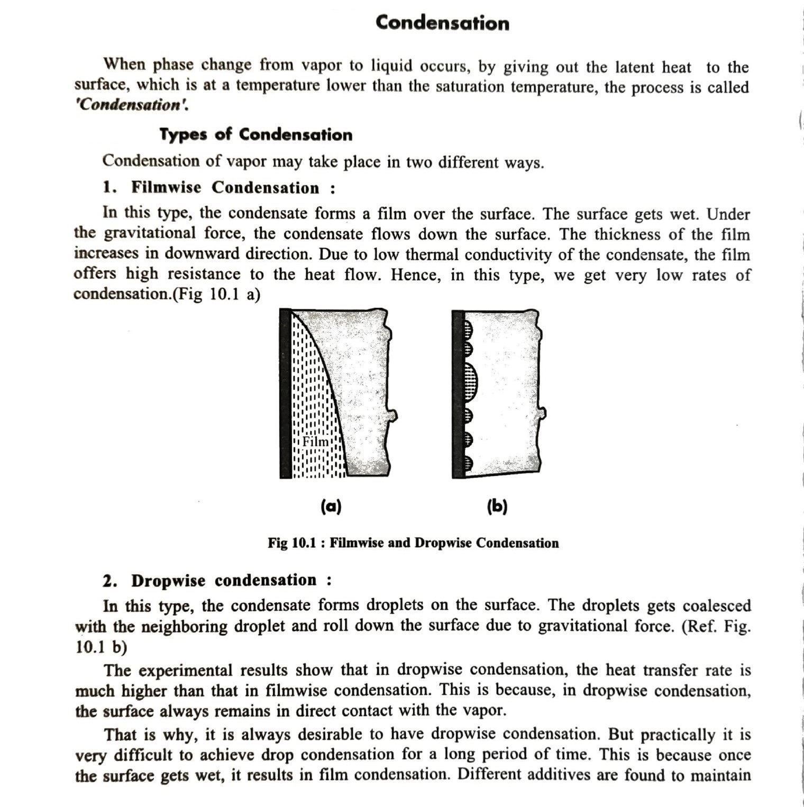
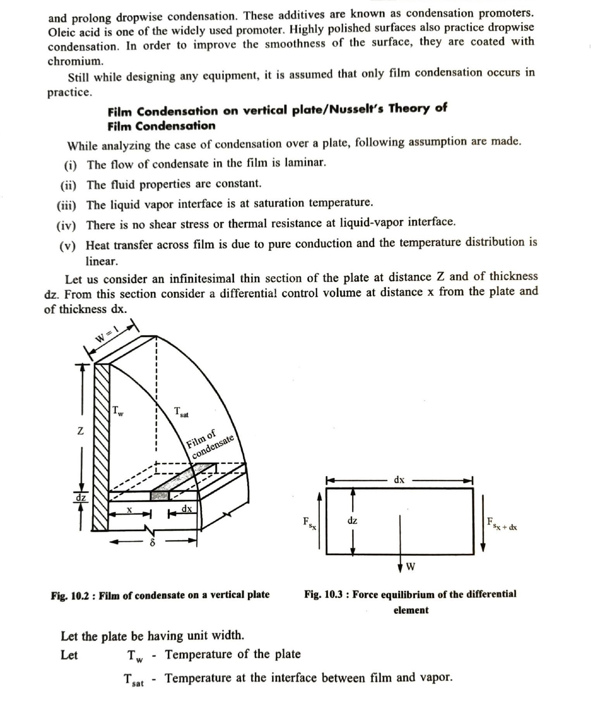
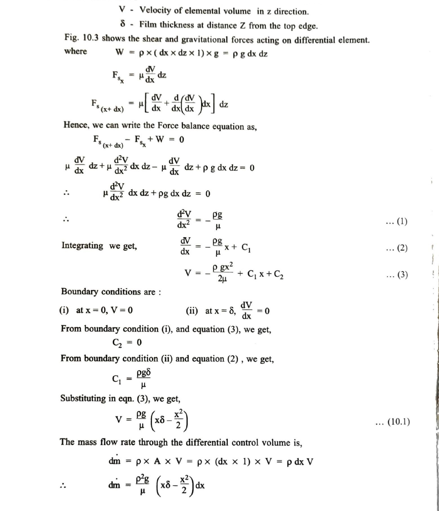
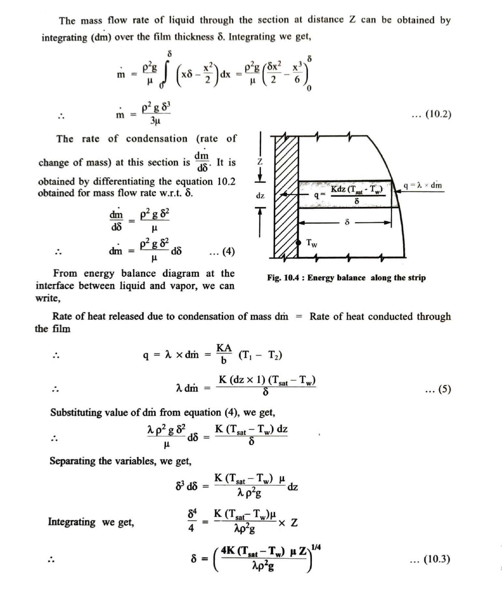
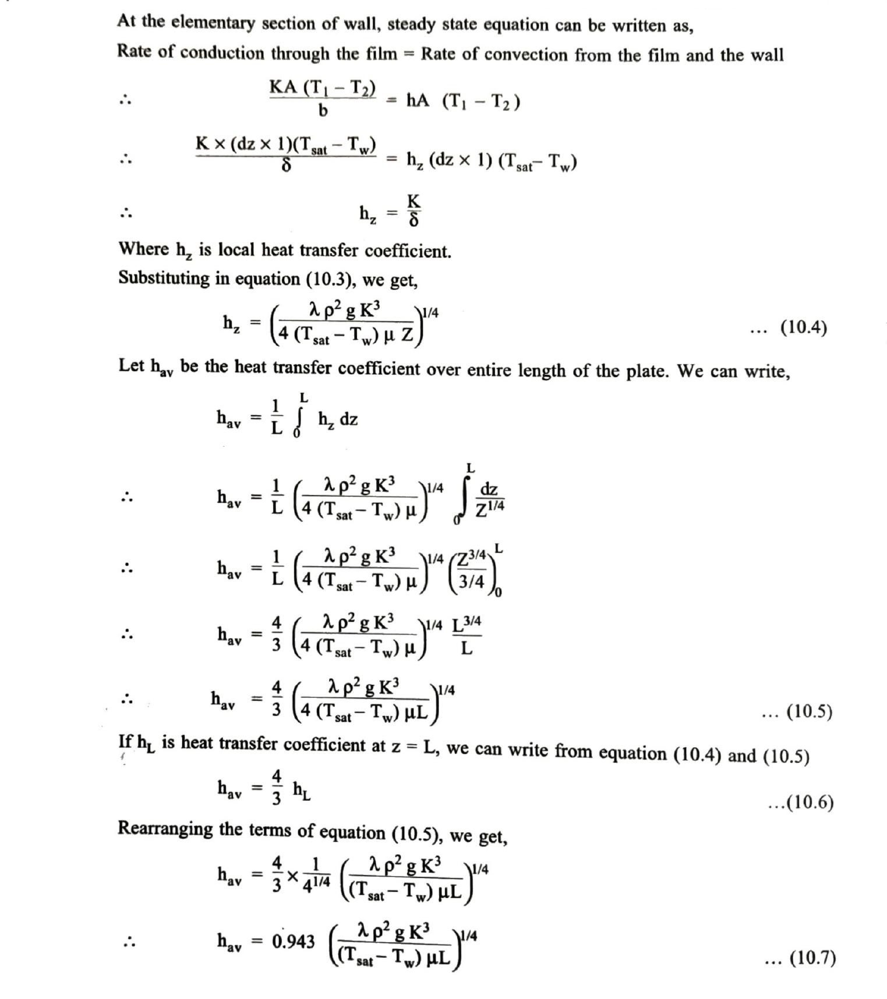
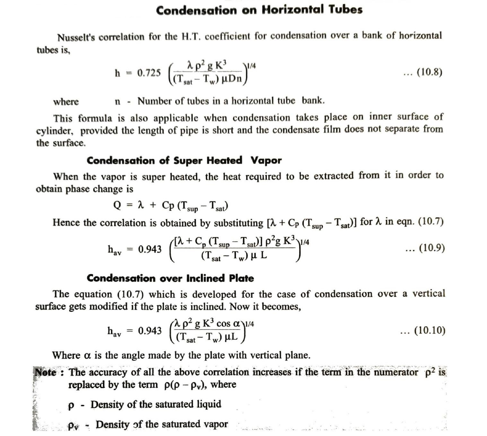

<!-- 

 -->

# Condensation

When phase change from vapor to liquid occurs, by giving out the latent heat to the surface, which is at a temperature lower than the saturation temperature, the process is called **'Condensation'**.

---

## Types of Condensation

Condensation of vapor may take place in two different ways.

### 1. Filmwise Condensation

In this type, the condensate forms a film over the surface. The surface gets wet. Under the gravitational force, the condensate flows down the surface. The thickness of the film increases in downward direction. Due to low thermal conductivity of the condensate, the film offers high resistance to the heat flow. Hence, in this type, we get very low rates of condensation.

<!-- IMAGE PLACEHOLDER: Fig 10.1(a) — Filmwise Condensation diagram -->
<!-- >  -->

### 2. Dropwise Condensation

In this type, the condensate forms droplets on the surface. The droplets gets coalesced with the neighboring droplet and roll down the surface due to gravitational force. (Ref. Fig. 10.1 b)

The experimental results show that in dropwise condensation, the heat transfer rate is much higher than that in filmwise condensation. This is because, in dropwise condensation, the surface always remains in direct contact with the vapor.

That is why, it is always desirable to have dropwise condensation. But practically it is very difficult to achieve drop condensation for a long period of time. This is because once the surface gets wet, it results in film condensation. Different additives are found to maintain and prolong dropwise condensation. These additives are known as condensation promoters. Oleic acid is one of the widely used promoter. Highly polished surfaces also practice dropwise condensation. In order to improve the smoothness of the surface, they are coated with chromium.

Still while designing any equipment, it is assumed that only film condensation occurs in practice.

---

## Film Condensation on Vertical Plate / Nusselt's Theory of Film Condensation

While analyzing the case of condensation over a plate, following assumptions are made:

(i) The flow of condensate in the film is laminar.

(ii) The fluid properties are constant.

(iii) The liquid vapor interface is at saturation temperature.

(iv) There is no shear stress or thermal resistance at liquid-vapor interface.

(v) Heat transfer across film is due to pure conduction and the temperature distribution is linear.

Let us consider an infinitesimal thin section of the plate at distance Z and of thickness dz. From this section consider a differential control volume at distance x from the plate and of thickness dx.

<!-- IMAGE PLACEHOLDER: Fig 10.2 and Fig 10.3 -->
<!-- > 

> -->

<!-- HTML tag - set any width you want -->

<!-- > 
> -->

Let the plate be having unit width.

Let:
- $T_w$ — Temperature of the plate
- $T_{sat}$ — Temperature at the interface between film and vapor
- $V$ — Velocity of elemental volume in z direction
- $\delta$ — Film thickness at distance Z from the top edge

Fig. 10.3 shows the shear and gravitational forces acting on differential element.

where

$$W = \rho \times (dx \times dz \times 1) \times g = \rho \, g \, dx \, dz$$

$$F_{s_x} = \mu \frac{dV}{dx} \, dz$$

$$F_{s_{(x+dx)}} = \mu \left[ \frac{dV}{dx} + \frac{d}{dx}\left(\frac{dV}{dx}\right) dx \right] dz$$

Hence, we can write the Force balance equation as,

$$F_{s_{(x+dx)}} - F_{s_x} + W = 0$$

$$\mu \frac{dV}{dx} \, dz + \mu \frac{d^2V}{dx^2} \, dx \, dz - \mu \frac{dV}{dx} \, dz + \rho \, g \, dx \, dz = 0$$

$$\therefore \quad \mu \frac{d^2V}{dx^2} \, dx \, dz + \rho g \, dx \, dz = 0$$

$$\therefore \quad \frac{d^2V}{dx^2} = -\frac{\rho g}{\mu} \tag{1}$$

Integrating we get,

$$\frac{dV}{dx} = -\frac{\rho g}{\mu} x + C_1 \tag{2}$$

$$V = -\frac{\rho \, g x^2}{2\mu} + C_1 x + C_2 \tag{3}$$

Boundary conditions are:

(i) at $x = 0,\ V = 0$ &nbsp;&nbsp;&nbsp;&nbsp;&nbsp;&nbsp;&nbsp;&nbsp; (ii) at $x = \delta,\ \dfrac{dV}{dx} = 0$

From boundary condition (i), and equation (3), we get,

$$C_2 = 0$$

From boundary condition (ii) and equation (2), we get,

$$C_1 = \frac{\rho g \delta}{\mu}$$

Substituting in eqn. (3), we get,

$$V = \frac{\rho g}{\mu} \left( x\delta - \frac{x^2}{2} \right) \tag{10.1}$$

The mass flow rate through the differential control volume is,

$$\dot{m} = \rho \times A \times V = \rho \times (dx \times 1) \times V = \rho \, dx \, V$$

$$\therefore \quad \dot{m} = \frac{\rho^2 g}{\mu} \left( x\delta - \frac{x^2}{2} \right) dx$$

The mass flow rate of liquid through the section at distance Z can be obtained by integrating $(\dot{m})$ over the film thickness $\delta$. Integrating we get,

$$\dot{m} = \frac{\rho^2 g}{\mu} \int_0^{\delta} \left( x\delta - \frac{x^2}{2} \right) dx = \frac{\rho^2 g}{\mu} \left( \frac{\delta x^2}{2} - \frac{x^3}{6} \right)_0^{\delta}$$

$$\therefore \quad \dot{m} = \frac{\rho^2 \, g \, \delta^3}{3\mu} \tag{10.2}$$

The rate of condensation (rate of change of mass) at this section is $\dfrac{d\dot{m}}{d\delta}$. It is obtained by differentiating the equation 10.2 obtained for mass flow rate w.r.t. $\delta$.

$$\frac{d\dot{m}}{d\delta} = \frac{\rho^2 \, g \, \delta^2}{\mu}$$

$$\therefore \quad d\dot{m} = \frac{\rho^2 \, g \, \delta^2}{\mu} \, d\delta \tag{4}$$

<!-- IMAGE PLACEHOLDER: Fig 10.4 -->
<!-- >  -->

From energy balance diagram at the interface between liquid and vapor, we can write,

Rate of heat released due to condensation of mass $d\dot{m}$ = Rate of heat conducted through the film

$$\therefore \quad q = \lambda \times d\dot{m} = \frac{KA}{b}(T_1 - T_2)$$

$$\therefore \quad \lambda \, d\dot{m} = \frac{K\,(dz \times 1)\,(T_{sat} - T_w)}{\delta} \tag{5}$$

Substituting value of $d\dot{m}$ from equation (4), we get,

$$\therefore \quad \frac{\lambda \, \rho^2 \, g \, \delta^2}{\mu} \, d\delta = \frac{K\,(T_{sat} - T_w)\,dz}{\delta}$$

Separating the variables, we get,

$$\delta^3 \, d\delta = \frac{K\,(T_{sat} - T_w)\,\mu}{\lambda \, \rho^2 g} \, dz$$

Integrating we get,

$$\frac{\delta^4}{4} = \frac{K\,(T_{sat} - T_w)\,\mu}{\lambda \rho^2 g} \times Z$$

$$\therefore \quad \delta = \left( \frac{4K\,(T_{sat} - T_w)\,\mu\,Z}{\lambda \rho^2 g} \right)^{1/4} \tag{10.3}$$

At the elementary section of wall, steady state equation can be written as,

Rate of conduction through the film = Rate of convection from the film and the wall

$$\therefore \quad \frac{KA\,(T_1 - T_2)}{b} = hA\,(T_1 - T_2)$$

$$\therefore \quad \frac{K \times (dz \times 1)(T_{sat} - T_w)}{\delta} = h_z\,(dz \times 1)\,(T_{sat} - T_w)$$

$$\therefore \quad h_z = \frac{K}{\delta}$$

Where $h_z$ is local heat transfer coefficient.

Substituting in equation (10.3), we get,

$$h_z = \left( \frac{\lambda \, \rho^2 \, g \, K^3}{4\,(T_{sat} - T_w)\,\mu\,Z} \right)^{1/4} \tag{10.4}$$

Let $h_{av}$ be the heat transfer coefficient over entire length of the plate. We can write,

$$h_{av} = \frac{1}{L} \int_0^L h_z \, dz$$

$$\therefore \quad h_{av} = \frac{1}{L} \left( \frac{\lambda \, \rho^2 \, g \, K^3}{4\,(T_{sat} - T_w)\,\mu} \right)^{1/4} \int_0^L \frac{dz}{Z^{1/4}}$$

$$\therefore \quad h_{av} = \frac{1}{L} \left( \frac{\lambda \, \rho^2 \, g \, K^3}{4\,(T_{sat} - T_w)\,\mu} \right)^{1/4} \left( \frac{Z^{3/4}}{3/4} \right)_0^L$$

$$\therefore \quad h_{av} = \frac{4}{3} \left( \frac{\lambda \, \rho^2 \, g \, K^3}{4\,(T_{sat} - T_w)\,\mu} \right)^{1/4} \frac{L^{3/4}}{L}$$

$$\therefore \quad h_{av} = \frac{4}{3} \left( \frac{\lambda \, \rho^2 \, g \, K^3}{4\,(T_{sat} - T_w)\,\mu L} \right)^{1/4} \tag{10.5}$$

If $h_L$ is heat transfer coefficient at $z = L$, we can write from equation (10.4) and (10.5):

$$h_{av} = \frac{4}{3}\, h_L \tag{10.6}$$

Rearranging the terms of equation (10.5), we get,

$$h_{av} = \frac{4}{3} \times \frac{1}{4^{1/4}} \left( \frac{\lambda \, \rho^2 \, g \, K^3}{(T_{sat} - T_w)\,\mu L} \right)^{1/4}$$

$$\therefore \quad h_{av} = 0.943 \left( \frac{\lambda \, \rho^2 \, g \, K^3}{(T_{sat} - T_w)\,\mu L} \right)^{1/4} \tag{10.7}$$

---

## Condensation on Horizontal Tubes

Nusselt's correlation for the H.T. coefficient for condensation over a bank of horizontal tubes is,

$$h = 0.725 \left( \frac{\lambda \, \rho^2 \, g \, K^3}{(T_{sat} - T_w)\,\mu D n} \right)^{1/4} \tag{10.8}$$

where $n$ — Number of tubes in a horizontal tube bank.

This formula is also applicable when condensation takes place on inner surface of cylinder, provided the length of pipe is short and the condensate film does not separate from the surface.

---

## Condensation of Super Heated Vapor

When the vapor is super heated, the heat required to be extracted from it in order to obtain phase change is:

$$Q = \lambda + C_p\,(T_{sup} - T_{sat})$$

Hence the correlation is obtained by substituting $[\lambda + C_p\,(T_{sup} - T_{sat})]$ for $\lambda$ in eqn. (10.7):

$$h_{av} = 0.943 \left( \frac{[\lambda + C_p\,(T_{sup} - T_{sat})]\,\rho^2 g\,K^3}{(T_{sat} - T_w)\,\mu\,L} \right)^{1/4} \tag{10.9}$$

---

## Condensation over Inclined Plate

The equation (10.7) which is developed for the case of condensation over a vertical surface gets modified if the plate is inclined. Now it becomes,

$$h_{av} = 0.943 \left( \frac{\lambda \, \rho^2 \, g \, K^3 \cos\alpha}{(T_{sat} - T_w)\,\mu L} \right)^{1/4} \tag{10.10}$$

Where $\alpha$ is the angle made by the plate with vertical plane.

> **Note:** The accuracy of all the above correlation increases if the term in the numerator $\rho^2$ is replaced by the term $\rho(\rho - \rho_v)$, where
> - $\rho$ — Density of the saturated liquid
> - $\rho_v$ — Density of the saturated vapor